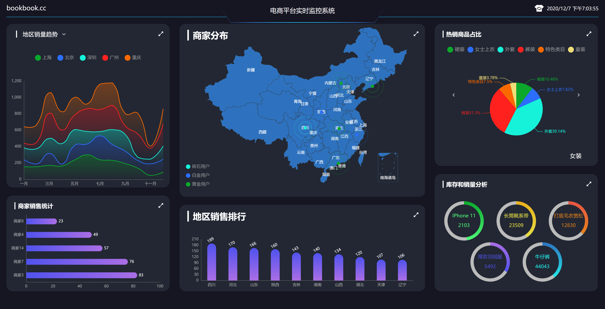
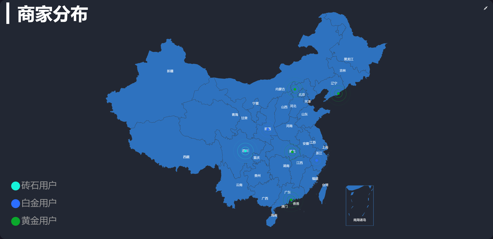
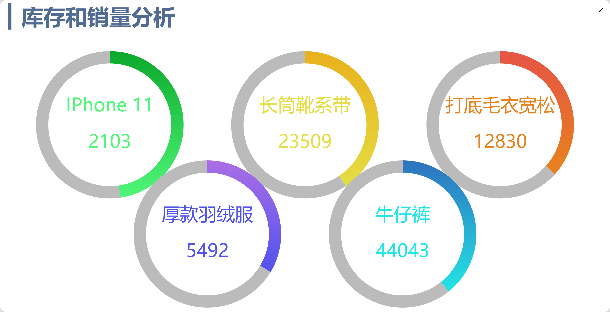

# vision

## vision电商平台数据可视化实时监控系统-Echarts-vue项目综合练习

## 项目前端地址：[点击前往](https://github.com/gogoBean/vision.git)

## 后端地址：[点击前往](https://github.com/gogoBean/koa_server.git)


## 二、如何运行该项目？

## Project setup
```
npm install
```

### Compiles and hot-reloads for development
```
npm run serve
```

### Compiles and minifies for production
```
npm run build
```

### Lints and fixes files
```
npm run lint
```

### Customize configuration
See [Configuration Reference](https://cli.vuejs.org/config/).

该项目主要使用 `Vue`搭配`Echarts`采用组件化的方式开发完成,此外项目中陆续使用有
- VueRouter
- VueX
- WebSocket
- axios
-  webpack
-  ES6/7
-  less 

## 三、运行效果截图

#### 2.1 黑色主题



#### 2.2 亮色主题


#### 2.3 热销商品占比


#### 2.4 商家分布



#### 2.5 地区销售排行


#### 2.6 商家销售统计


#### 2.7 库存和销量分析



#### 2.8 地区销量趋势


